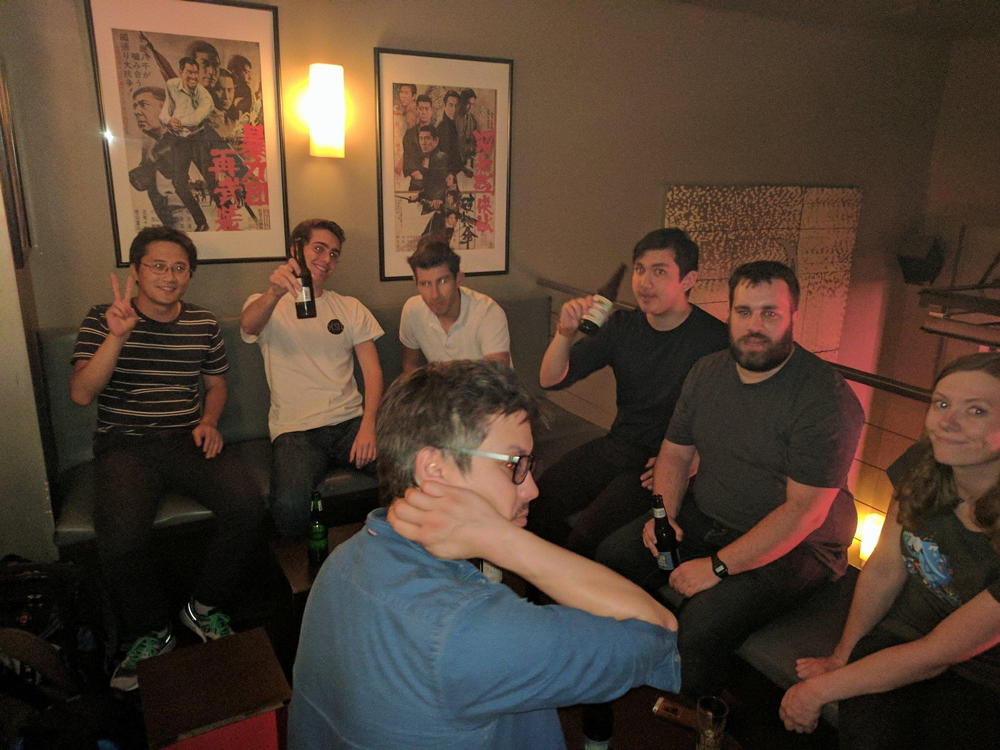
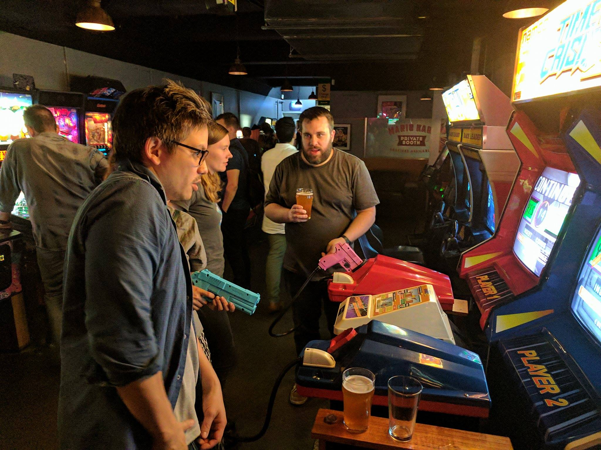

layout: post
title: Semester One Meet and Greet
author: Jonathon Belotti
date:   2017-03-10
---

Recaping our first social event of the year.
<!--excerpt-->
## Semester One Meet and Greet
-----

## Robot Bar First

The *Robot Bar* in the CBD became the venue for our first social event of the year after "Robot Bar, Melbourne" was used as a placeholder string by our poster designer, confusing the poster distributor because it's an actual bar!

Though there was an unfortunate lack of beer jugs to purchase, it was a nice place to sit and meet some CSIT students, old and new, for the first time.

## Bartronica Second

After a couple of hours, those continuing on headed 50m down the road to *Bartronica*, because it has Mario Kart and Time Crisis and that's the only reason you need.

It was good fun at that place, and we might to go back soon in the future with a decent budget for members to just go ham on the arcade and N64 games.

If you missed out this time, make sure to keep following the goings on at [The RMIT CSIT Society on Facebook](https://www.facebook.com/groups/rmitcsitsociety/) for the next one.

Cheers for now.

Jono Belotti
