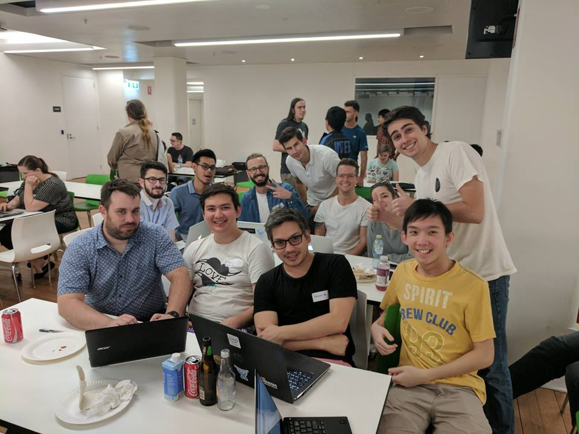

My motivation for running Meetup of the week has been to encourage students to join me in pushing beyond the bare minimum required to get a degree, and to explore the myriad of career building opportunities available right at our doorstep.

<!--excerpt-->
 
### What is a Meetup? 
A Meetup is a social event with the purpose bringing together strangers who share a common interest. There are all kinds of Meetups available through [Meetup.com](meetup.com), from rock climbing sessions, to robot building workshops, to even salsa dancing classes. Unbeknownst to most, there are also heaps of free programming, software, and design related Meetups as well, right in the heart of the CBD! This means they’re only a 10-15 minute walk from RMIT.

### What are they like?
Most Meetups tend to follow the same general structure. Pizza/beer/networking for the first 10-30 minutes, followed by 60-90 minutes of talks/presentations, and then a little more time for networking and drinks as the event wraps up. This final part is a great opportunity to introduce yourself to the speaker(s) and have a chat about something they presented that you found particularly interesting. Some Meetups will also encourage you to join the speakers at the pub afterwards to continue the conversation over a pint.

Almost all Meetups are complete free to attend, even the ones that provide beer and pizza!

### Why are Meetups useful for students?
Meetups are a really excellent way to practise your networking skills. The idea of striking up a conversation with a random stranger might seem uncomfortable or even daunting to some, but it seriously gets easier and easier the more you try it. I saw my own interpersonal skills improve significantly just by pushing myself to get out there and talk to new people. The free beer also definitely helps here. 

There are so many different tech-related Meetups that there’s almost guaranteed to be one dedicated to that new language or technology you’ve been wanting to learn. Or perhaps you’re really interested in design and want to hear some opinions from a UX expert. No matter your focus, there will always be new and valuable things to learn by listening to the presentations and engaging with other attendees. 

Furthermore, by attending Meetups, **and talking to people**, you are getting your name and face out there and have already begun building your brand. Though it’s certainly important to pay attention in school and develop your skillset, oftentimes “who you know” is even more valuable than “what you know”. Making the right connections and conveying your passion and enthusiasm to the right person can set you up for opportunities you didn’t know existed. After all, the best jobs are unadvertised. That’s why it’s so crucial to engage and speak to new people at these Meetups, especially the speakers. You already know you share a common interest with everyone else at the Meetup, so chances are you’ll make some good friends!

Finally, you might be thinking “Well I’m just a student, I know barely anything about this Meetup topic so people will think it’s strange if I go.” Nobody will think it’s strange! The organisers especially are always excited to see students getting involved at their events, and everyone there understands you have to start from somewhere. It’s perfectly okay to admit to other more experienced attendees “I actually don’t know much about this topic yet, but I’m really quite interested to learn!” Any time I’ve said this myself, I’ve always been met with a smile and they’re impressed to see a student taking the initiative to seize these opportunities.

### Why did I run Meetup of the Week?
My motivation for running Meetup of the week has been to encourage students to join me in pushing beyond the bare minimum required to get a degree, and to explore the myriad of career building opportunities available right at our doorstep. By personally attending each Meetup, I hoped to provide students with a familiar face in an otherwise uncharted environment and to prevent the excuse “But I don’t know anyone there!”

I really want other students to give Meetups a go and hopefully start down the same path that I’ve been following. There is so much to be gained by simply putting yourself out there and seeing what happens.

### How did Meetup of the Week go this year?
Overall I think MotW was a successful endeavor as I met a bunch of different students who joined me throughout the year (if you’re reading this, you’re awesome!) and in the end we ran 33 MotWs across both semesters (and the gap between them). Some weeks were quiet and left me attending the weekly Meetup alone, but that was to be expected and I still enjoyed representing the CSIT Society each time. I found my favourite Meetups to be Software Art Thou, SecTalks, and Machine Learning & AI.

### What improvements will I make to Meetup of the Week next year?
I think one problem that affected attendance was that I would sometimes select the Meetup for the week too late and not provide everyone with enough notice to fit it into their schedules. This often occurred because my own schedule was quite busy, and I would end up procrastinating my selection. But procrastination begone! Next semester I will ensure I provide at least a week’s notice before each Meetup so that you have more time to plan your own week.

Another issue with MotW was that often the posts would get lost beneath the other frequent posts in the CSIT Society Facebook group. To combat this, I will be creating Facebook group events for each MotW so it will be much easier to find the necessary information. This will have the added bonus of allowing you to see who else is going and be able to add to your Facebook calendar by just clicking “interested”. I trialled this for the last MotW of the year and it appeared to be received positively. 

Finally, running MotW alone can become quite taxing during busy periods of the semester and some weekly selections end up heavily influenced by my own availability. If I’m able to distribute the responsibility and involve other people in the operation of MotW next year, that will have a very positive effect on the variety and diversity of the different Meetups selected each week.

### Thanks for reading!
Meetup of the week has been an excellent experiment that I believe has really paid off. As it resumes next semester, I hope to continue to see familiar faces and also many new ones! 

